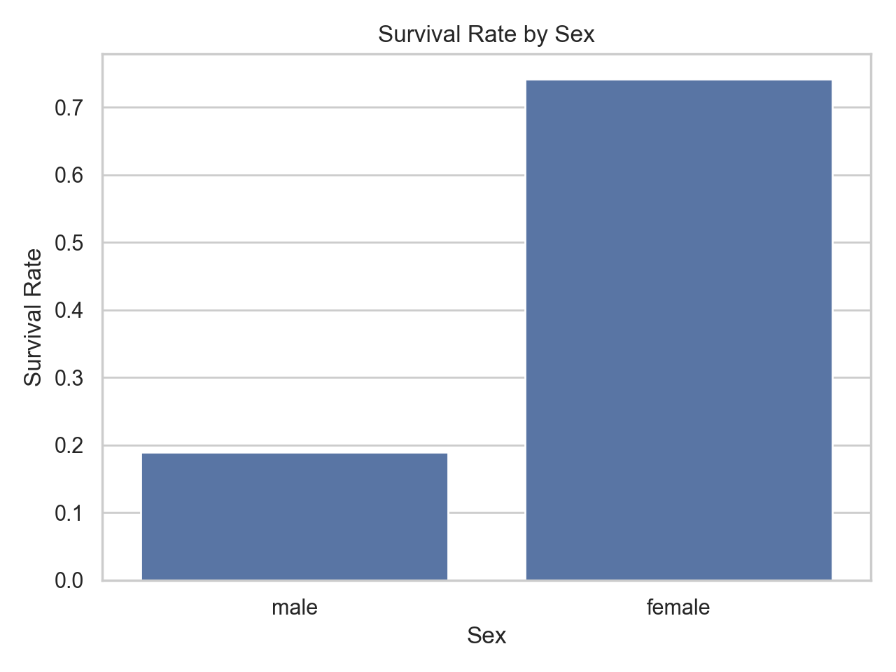
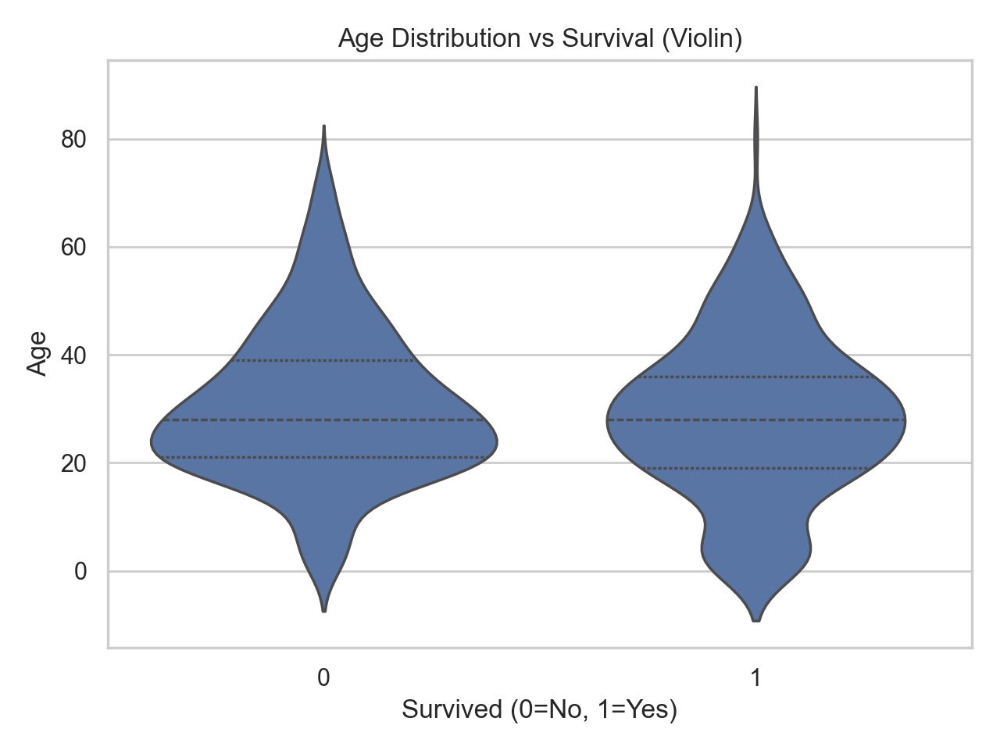
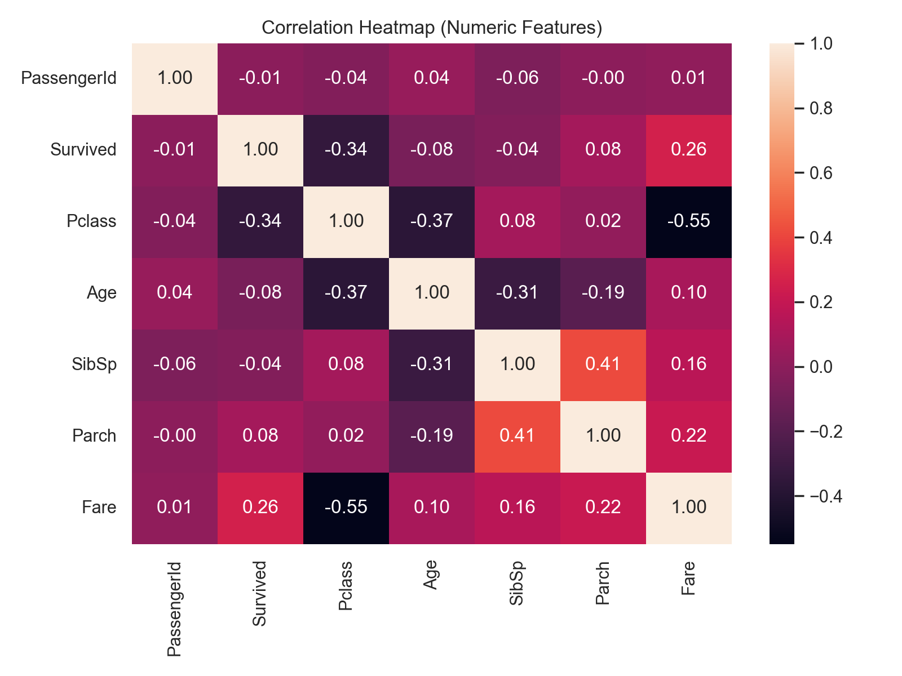
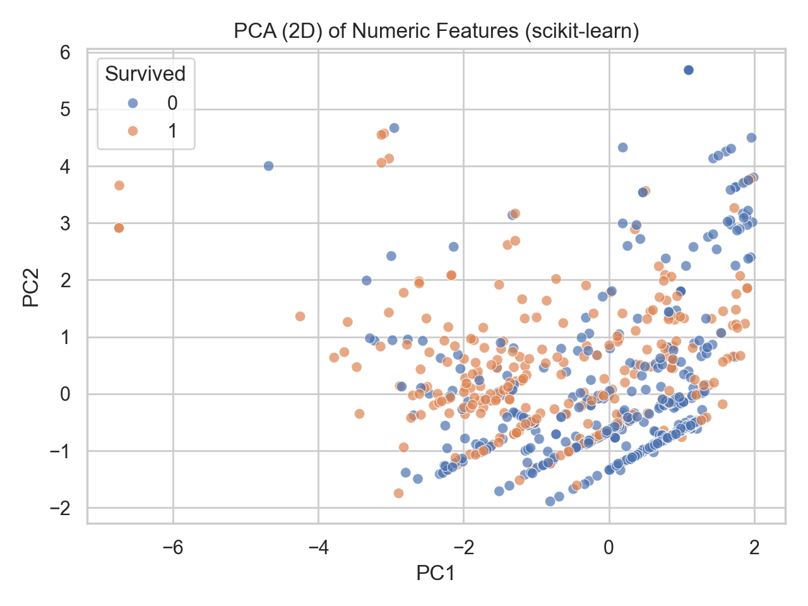
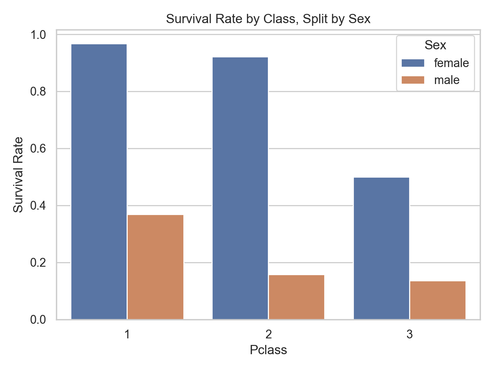
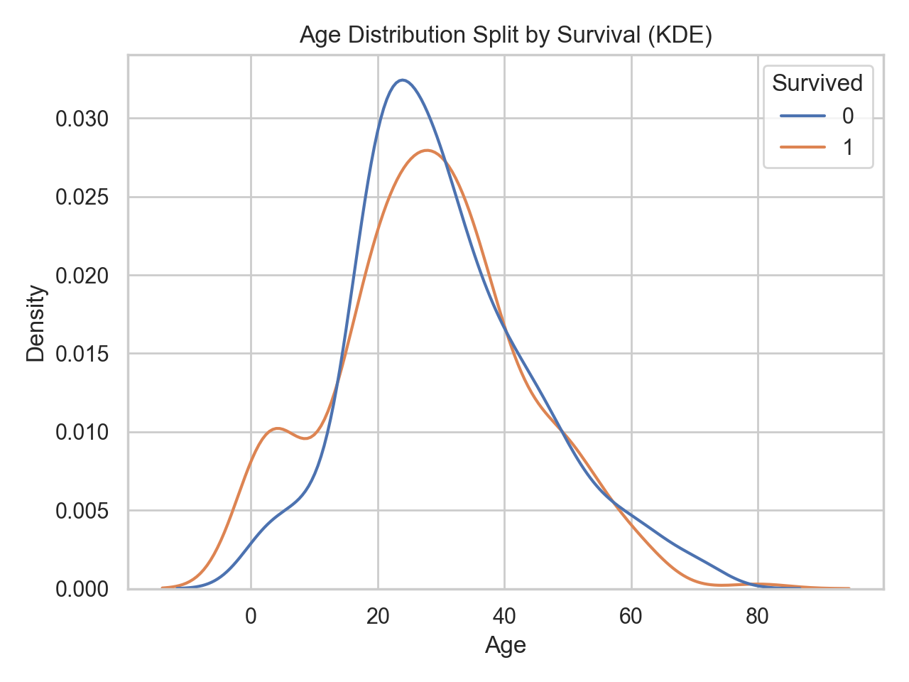
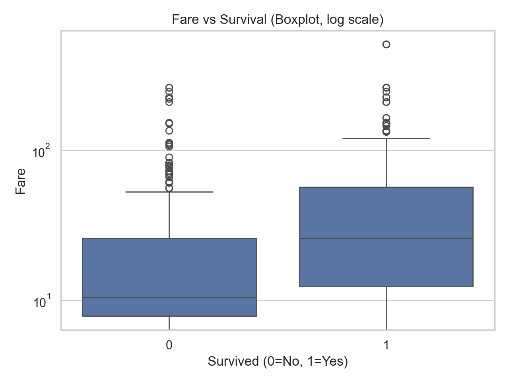
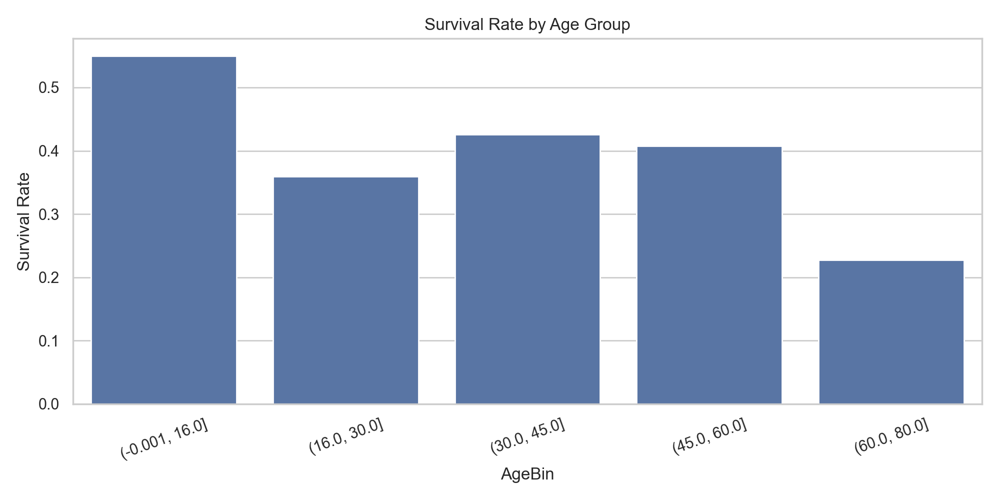

# Project 01 — Titanic Survival Classification

## Goal
Predict passenger survival using structured tabular data.

## Tech
Python, pandas, scikit-learn, matplotlib, seaborn

## Repo Structure
- `data/` raw/interim/processed (not tracked in git)
- `notebooks/` exploration (optional)
- `src/` reusable code
- `reports/` figures + results
- `models/` saved models (not tracked in git)

## Visualizations (saved in `reports/figures/`)
A few highlights:

### Survival Rate by Sex


### Survival Rate by Passenger Class


### Age vs Survival (Violin)


### Correlation Heatmap


### PCA (2D) of Numeric Features


### Survival Rate by Class, Split by Sex


### Age Distribution Split by Survival (KDE)


### Fare vs Survival (Boxplot)


### Survival Rate by Age Group


## Setup
```bash
python3 -m venv .venv
source .venv/bin/activate
pip install -r requirements.txt
